<div align="center">
  
# 👋 Hey, I'm Tejas Garg

### AI/ML Engineer | Researcher | Builder


[](https://linkedin.com/in/tejas-garg)
[](mailto:tejas@tejasgarg.in)
[](https://tejasgarg.in)

</div>

---

## 🚀 About Me

```python
class TejasGarg:
    def __init__(self):
        self.education = "CSE (AIML) @ IIIT"
        self.location = "Nagpur, India"
        self.current_focus = [
            "Real-time Computer Vision",
            "Diffusion Models & Generative AI",
            "Explainable AI (XAI)",
            "LLM + Reinforcement Learning"
        ]
        self.interests = [
            "ML Systems Design",
            "Applied Research",
            "Production AI at Scale"
        ]
    
    def say_hi(self):
        print("Thanks for stopping by! Let's build something amazing together 🚀")

me = TejasGarg()
me.say_hi()
```

---

## 🛠️ Tech Stack

### Languages


### AI/ML & Deep Learning


### MLOps & Tools


### Web & Backend


---

## 🔬 Featured Projects

### 🎯 Research & Applied ML

<table>
<tr>
<td width="50%">

#### 🔍 [XAI for Diffusion Models](https://github.com/garg-tejas/xai-diffusion-based-models)
Explainable AI framework for medical imaging with temporal & causal interpretability
- **Stack:** PyTorch, Custom XAI explainer
- **Impact:** Improved model transparency for clinical use
- **Techniques:** Counterfactual analysis, attention visualization

</td>
<td width="50%">

#### 🧠 [Teaching Mistral to Think](https://github.com/garg-tejas/teaching-mistral-to-think)
Applied GRPO reinforcement learning to improve reasoning in Mistral-7B
- **Stack:** Transformers, RL, PEFT
- **Result:** Enhanced GSM8K math accuracy
- **Method:** Group Relative Policy Optimization

</td>
</tr>
<tr>
<td width="50%">

#### 🏭 [Lab Safety Monitor](https://github.com/garg-tejas/lab-safety-monitor)
Real-time PPE compliance system with multi-person tracking & face recognition
- **Stack:** YOLO, SAM, DeepSORT
- **Features:** Event deduplication, temporal filtering
- **Scale:** Production-ready deployment

</td>
<td width="50%">

#### 💬 [NL2SQL](https://github.com/garg-tejas/nl2sql)
Natural language to SQL with schema reasoning & verification
- **Stack:** LLMs, Prompt Engineering
- **Security:** SQL injection prevention
- **Benchmark:** Evaluated on Spider dataset

</td>
</tr>
<tr>
<td width="50%">

#### 🧬 [Noesis](https://github.com/garg-tejas/noesis)
AI knowledge distillation app with auto-tagging & contradiction detection
- **Stack:** TypeScript, Vector DB, LLMs
- **Features:** Smart summarization, knowledge graphs
- **Use Case:** Personal knowledge management

</td>
<td width="50%">

#### 🩸 [Blood Report Parser](https://github.com/garg-tejas/blood-report-parser)
AI dashboard for medical report analysis with vision models
- **Stack:** Vision LLMs, React, Chart.js
- **Features:** Biomarker extraction, visualizations
- **Interface:** Interactive chat & insights

</td>
</tr>
</table>

---

## 📊 GitHub Stats

<div align="center">
  
[](https://git.io/streak-stats)

[](https://github.com/anuraghazra/github-readme-stats)

[](https://github.com/anuraghazra/github-readme-stats)

</div>

---

## 🎯 Currently Working On

```mermaid
graph LR
    A[🔬 Research] --> B[Diffusion Models]
    A --> C[XAI Methods]
    D[🏗️ Production] --> E[CV Pipelines]
    D --> F[LLM Applications]
```



- 🧪 **Research:** Exploring interpretability in generative models
- 🚀 **Building:** Real-time CV systems for industrial applications
- 📖 **Learning:** Advanced RL techniques, distributed training
- 🤝 **Collaborating:** Open to research partnerships & interesting projects

---

## 📈 Contribution Graph


---

## 💡 What I'm About

```
🔬 Research + 🛠️ Engineering = 🚀 Real Impact
```

I believe in:
- **📊 Data-driven decision making** over gut feelings
- **🔍 Interpretable AI** over black-box models (when possible)
- **⚡ Fast iteration** over perfect planning
- **🤝 Open collaboration** over solo work
- **📚 Continuous learning** over staying comfortable

---

## 📫 Let's Connect!

I'm always excited to discuss:
- 🤖 AI/ML research ideas & collaborations
- 🏗️ Production ML system design
- 🎯 Career opportunities in ML engineering
- 💡 Cool projects & open source contributions

**Reach out:** [Email](mailto:tejas@tejasgarg.in) | [LinkedIn](https://linkedin.com/in/tejas-garg)

---

<div align="center">

### ⭐ "In AI, today's magic is tomorrow's commodity. Keep learning, keep building."


</div
